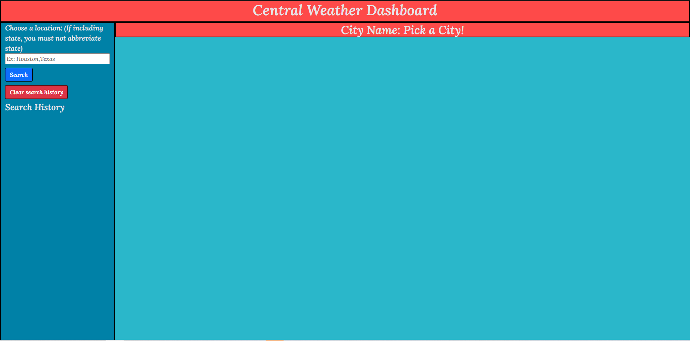
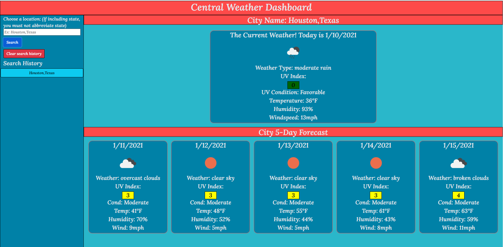
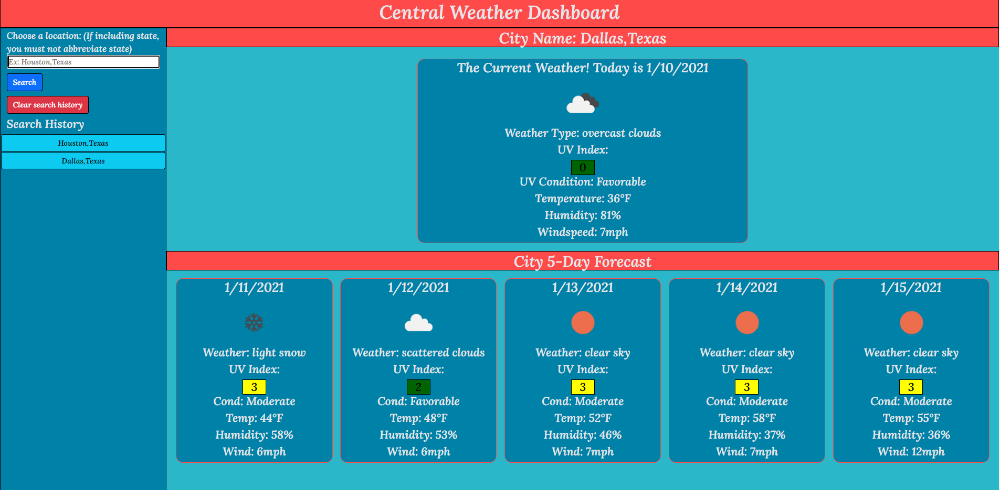

# WeatherCentral

## Link to My Deployed Application

https://joeseff6.github.io/WeatherCentral/

## Project Description

The purpose of the deployed application is to provide a weather dashboard that the user can utilize for checking the weather in a requested city.

## What to Expect From the Application

The user can go into this web application and pull up the weather for a specified city. Say, for example, the user wants to see the estimated weather in Houston, Texas for the next 5 days. They can search by either the city name or the city,state and pull up the 5-day forecast at that time and even view the current weather. This application utilizes the server-side OpenWeather API to retrieve data about the destination's weather, and will dynamically populate the webpage. Some features include a list of the user's previous search history, with the ability to click on search list items, and data persistence of the last searched city.

## Tasks to Complete the Job :white_check_mark:
- [x] Provide a search function so a user can bring up the current and 5-day forecast for a given city
- [x] Save the user's search history
- [x] The city name, date, icon for the weather, temp, humidity, wind speed, UV index will be shown
- [x] The UV index will be presented with a color indicating the condition (favorable, moderate, or severe)
- [x] The user can click on an item in the search history and bring up new data for that city
- [x] The last searched city is shown for persistence

## Future Releases

* Display a modal if multiple search results are retrieved for a specified destination
* Capitalize first letter of each word in the city name if user enters lowercased destination

### Screenshots

